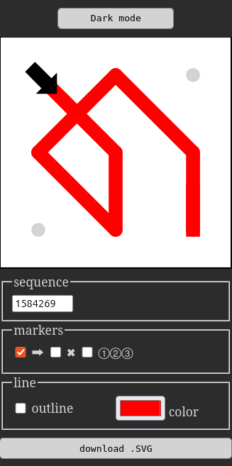

# Draw Lock Pattern (JavaScript)

An interactive Android-style lock pattern simulator, built entirely with HTML, CSS, SVG, and vanilla JavaScript.

This tool lets you generate and visualize lock patterns using a numeric sequence, or draw them directly with your mouse.

## Features

- Input numeric sequences to generate patterns
- Alternatively, draw patterns manually with the mouse
- Customizable colors and markers
- Downloadable .SVG files
- Reset the drawing with the Escape key

## Preview
<p align="center">
  
</p>

## Usage

### With the input field

- Type a numeric sequence in the input field
- Each digit corresponds to a point on the 3x3 grid:
```
1 2 3
4 5 6
7 8 9
```
- Example: `1235789` → Z-shape pattern

### With the mouse

- Alternatively, click and hold the left mouse button over a point to start drawing
- Drag your mouse across the grid to connect multiple points
- Release the mouse button to complete the pattern

## Installation

Just clone the repository and open the `index.html` file in your browser, or try the [live demo](https://quatudi.github.io/draw-lock-pattern-js/).

---

## About

This project was created by [Charles Tuloup](https://github.com/Quatudi).

Feel free to use, modify, or contribute.

## License

This project is licensed under the GPL-3.0 License.
